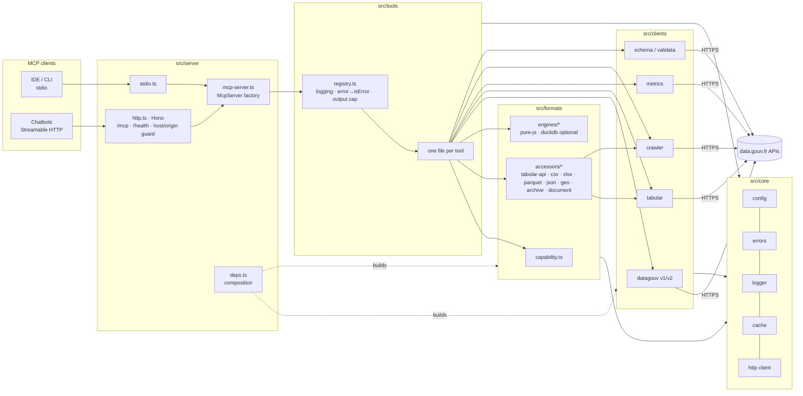

# data.gouv.fr MCP Server


[](https://github.com/giter010101/datagouv-mcp-ts/actions/workflows/ci.yml)
[](https://github.com/giter010101/datagouv-mcp-ts/actions/workflows/nightly-live.yml)
[](https://www.npmjs.com/package/datagouv-mcp)
[](.nvmrc)
[](https://modelcontextprotocol.io)
[](LICENSE)

> **En bref (FR).** Ce serveur [MCP](https://modelcontextprotocol.io) permet à un assistant IA
> (Claude, ChatGPT, Le Chat, Gemini, Cursor, VS Code…) de chercher, explorer et interroger les
> jeux de données de [data.gouv.fr](https://www.data.gouv.fr), la plateforme nationale d'open data,
> directement dans la conversation : « Quels jeux de données existent sur les prix de l'immobilier ? »,
> « Montre-moi les dix premières lignes du fichier des bornes de recharge ». Il est utilisable tel quel
> via l'instance publique `https://mcp.data.gouv.fr/mcp`, ou en local avec `npx datagouv-mcp`.
> Le reste de ce document est en anglais.

> [!TIP]
> Got feedback? [Tell us about it here](https://tally.so/r/KYMboX).

**datagouv-mcp** is a [Model Context Protocol](https://modelcontextprotocol.io) server written in
TypeScript that gives LLM clients read-only, structured access to the data.gouv.fr catalogue
(≈74k datasets, ≈690k resources, ≈1.2k APIs) and to the data itself: search datasets, organizations
and third-party APIs, inspect resources, and query tabular files through the Tabular API — with a
format-aware data-access layer (CSV, XLSX, Parquet, JSON, GeoJSON, archives…) that lets an assistant
preview and query **any** resource without protocol-level errors.

It is the TypeScript successor of the Python server previously deployed at `mcp.data.gouv.fr`
(see [Migration from the Python server](docs/migration-from-python.md)); all legacy tool names,
parameters and messages are preserved.

## Contents

- [Quick start](#quick-start)
- [Connect your client](#connect-your-client)
- [Tools](#tools)
- [Architecture](#architecture)
- [Configuration](#configuration)
- [Development](#development)
- [Deployment](#deployment)
- [Contributing](#contributing) · [Security](#security) · [License](#license)

## Quick start

Three ways to use the server. Pick one:

| | How | For |
|---|---|---|
| **Hosted** | `https://mcp.data.gouv.fr/mcp` (Streamable HTTP, no auth, no API key) | Web chatbots (ChatGPT, Le Chat, HuggingChat), anyone who does not want to run anything |
| **Local stdio** | `npx -y datagouv-mcp` | IDEs and CLIs (Cursor, VS Code, Claude Code/Desktop, Gemini CLI, Kiro, Windsurf…) |
| **Self-hosted HTTP** | `npx -y datagouv-mcp --http` or `docker compose up -d` | Your own `/mcp` endpoint, behind a reverse proxy |

> [!NOTE]
> Until `1.0.0` is published, the npm package is on the `alpha` dist-tag: use `npx -y datagouv-mcp@alpha`
> in the examples below, or run from source (`pnpm dev`). Requires Node.js ≥ 22.

### Local stdio (default)

```shell
npx -y datagouv-mcp            # speaks MCP over stdin/stdout; logs go to stderr
npx -y datagouv-mcp --help
```

### Streamable HTTP

```shell
npx -y datagouv-mcp --http                      # http://127.0.0.1:8000/mcp  +  GET /health
npx -y datagouv-mcp --http --port 8007 --host 127.0.0.1
MCP_TRANSPORT=http MCP_PORT=8007 npx -y datagouv-mcp   # same, via environment
curl -s http://127.0.0.1:8007/health             # {"status":"ok","version":"…","env":"local","data_env":"prod"}
```

### Docker

```shell
docker compose up -d                              # image built locally, http://127.0.0.1:8000/mcp
MCP_PORT=8007 DATAGOUV_API_ENV=demo LOG_LEVEL=debug docker compose up -d
docker compose down

# or the published image
docker run --rm -p 8000:8000 ghcr.io/giter010101/datagouv-mcp:edge
```

Details, reverse proxy and hardening: [docs/deployment.md](docs/deployment.md).

## Connect your client

Every client below works with the **hosted endpoint** (`https://mcp.data.gouv.fr/mcp`, or your own
`http://127.0.0.1:8000/mcp` when self-hosting) and, when the client supports local servers, with the
**stdio** command `npx -y datagouv-mcp`. Use stdio for IDE/CLI tools (no network hop, always the
latest package); use HTTP for web chatbots or when you want one shared instance.

[AnythingLLM](#anythingllm) · [Autohand Code](#autohand-code) · [ChatGPT](#chatgpt) · [Claude Code](#claude-code) · [Claude Desktop](#claude-desktop) · [Cursor](#cursor) · [Gemini CLI](#gemini-cli) · [HuggingChat](#huggingchat) · [IBM Bob](#ibm-bob) · [Kiro CLI](#kiro-cli) · [Kiro IDE](#kiro-ide) · [Le Chat (Mistral)](#le-chat-mistral) · [Mistral Vibe CLI](#mistral-vibe-cli) · [OpenCode](#opencode) · [VS Code](#vs-code) · [Windsurf](#windsurf)

### AnythingLLM

Edit `anythingllm_mcp_servers.json` in the AnythingLLM storage plugins directory
(Linux `~/.config/anythingllm-desktop/storage/plugins/`, macOS `~/Library/Application Support/anythingllm-desktop/storage/plugins/`,
Windows `%APPDATA%\anythingllm-desktop\storage\plugins\`):

```json
{
  "mcpServers": {
    "datagouv": {
      "type": "streamable",
      "url": "https://mcp.data.gouv.fr/mcp"
    }
  }
}
```

Local stdio variant:

```json
{
  "mcpServers": {
    "datagouv": {
      "command": "npx",
      "args": ["-y", "datagouv-mcp"]
    }
  }
}
```

See the [AnythingLLM MCP documentation](https://docs.anythingllm.com/mcp-compatibility/overview).

### Autohand Code

```shell
# hosted / self-hosted HTTP
autohand mcp add --transport http datagouv https://mcp.data.gouv.fr/mcp
# local stdio
autohand mcp add --transport stdio datagouv -- npx -y datagouv-mcp
```

Add `--scope project` to keep the registration in the current workspace. Docs: [Autohand Code](https://github.com/autohandai/code-cli/).

### ChatGPT

*Paid plans only (Plus, Pro, Team, Enterprise). Remote servers only.*

1. `Settings` → `Apps and connectors` → `Advanced settings` → enable **Developer mode**.
2. `Settings` → `Connectors` → `Browse connectors` → **Add a new connector**.
3. URL: `https://mcp.data.gouv.fr/mcp`, no authentication, save.

### Claude Code

```shell
# local stdio (recommended)
claude mcp add datagouv -- npx -y datagouv-mcp
# hosted / self-hosted HTTP
claude mcp add --transport http datagouv https://mcp.data.gouv.fr/mcp
```

### Claude Desktop

Config file: Linux `~/.config/Claude/claude_desktop_config.json`, macOS
`~/Library/Application Support/Claude/claude_desktop_config.json`, Windows `%APPDATA%\Claude\claude_desktop_config.json`.

Local stdio (no extra dependency):

```json
{
  "mcpServers": {
    "datagouv": {
      "command": "npx",
      "args": ["-y", "datagouv-mcp"]
    }
  }
}
```

Hosted endpoint through [`mcp-remote`](https://www.npmjs.com/package/mcp-remote) (or add it as a
custom connector in `Settings → Connectors` on plans that support remote MCP):

```json
{
  "mcpServers": {
    "datagouv": {
      "command": "npx",
      "args": ["-y", "mcp-remote", "https://mcp.data.gouv.fr/mcp"]
    }
  }
}
```

**Windows:** if the server shows up but never connects, Claude may use its bundled Node.js which
cannot see your `npm` packages. Set `"isUsingBuiltInNodeForMcp": false` at the **root** of the same
file and restart Claude Desktop ([background](https://github.com/datagouv/datagouv-mcp/issues/69)).

### Cursor

`Cursor Settings` → `MCP` → **Add new MCP server**, or edit `~/.cursor/mcp.json` (global) /
`.cursor/mcp.json` (project):

```json
{
  "mcpServers": {
    "datagouv": {
      "command": "npx",
      "args": ["-y", "datagouv-mcp"]
    }
  }
}
```

HTTP variant:

```json
{
  "mcpServers": {
    "datagouv": {
      "url": "https://mcp.data.gouv.fr/mcp",
      "transport": "http"
    }
  }
}
```

### Gemini CLI

`~/.gemini/settings.json` (Windows `%USERPROFILE%\.gemini\settings.json`):

```json
{
  "mcpServers": {
    "datagouv": {
      "command": "npx",
      "args": ["-y", "datagouv-mcp"]
    }
  }
}
```

HTTP variant: replace the entry with `{ "httpUrl": "https://mcp.data.gouv.fr/mcp" }`.

### HuggingChat

*Remote servers only.*

1. Click **+** in the chat → `MCP Servers` → `Manage MCP Servers` → **Add Server**.
2. Name `Data Gouv`, URL `https://mcp.data.gouv.fr/mcp`, **Add Server**.
3. Click **Health Check** on the card; it should read **Connected**. Keep the toggle on.

### IBM Bob

Bob panel → settings icon → `MCP` tab → **Edit Global MCP** (`mcp_settings.json`) or **Edit Project MCP** (`.bob/mcp.json`):

```json
{
  "mcpServers": {
    "datagouv": {
      "url": "https://mcp.data.gouv.fr/mcp",
      "type": "streamable-http"
    }
  }
}
```

Local stdio variant: `{ "command": "npx", "args": ["-y", "datagouv-mcp"], "type": "stdio" }`.

### Kiro CLI

`~/.kiro/settings/mcp.json` (Windows `%USERPROFILE%\.kiro\settings\mcp.json`):

```json
{
  "mcpServers": {
    "datagouv": {
      "command": "npx",
      "args": ["-y", "datagouv-mcp"]
    }
  }
}
```

HTTP variant: `{ "url": "https://mcp.data.gouv.fr/mcp" }`.

### Kiro IDE

Same file format as Kiro CLI: `.kiro/settings/mcp.json` in the workspace, or the global
`~/.kiro/settings/mcp.json`. Use the stdio block above or `{ "url": "https://mcp.data.gouv.fr/mcp" }`.

### Le Chat (Mistral)

*All plans, including free. Remote servers only.*

1. `Intelligence` → `Connectors` → **Add connector** → **Custom MCP Connector**.
2. Name `DataGouv`, server URL `https://mcp.data.gouv.fr/mcp`, authentication disabled.
3. **Create**.

### Mistral Vibe CLI

`~/.vibe/config.toml` (Windows `%USERPROFILE%\.vibe\config.toml`):

```toml
# local stdio
[[mcp_servers]]
name = "datagouv"
transport = "stdio"
command = "npx"
args = ["-y", "datagouv-mcp"]

# or hosted / self-hosted HTTP
# [[mcp_servers]]
# name = "datagouv"
# transport = "streamable-http"
# url = "https://mcp.data.gouv.fr/mcp"
```

Reference: [Vibe MCP server configuration](https://github.com/mistralai/mistral-vibe?tab=readme-ov-file#mcp-server-configuration).

### OpenCode

`opencode.json` (`~/.config/opencode/opencode.json` or project root). See [OpenCode MCP servers](https://opencode.ai/docs/mcp-servers/).

```json
{
  "$schema": "https://opencode.ai/config.json",
  "mcp": {
    "datagouv": {
      "type": "local",
      "command": ["npx", "-y", "datagouv-mcp"],
      "enabled": true
    }
  }
}
```

HTTP variant: `{ "type": "remote", "url": "https://mcp.data.gouv.fr/mcp", "enabled": true }`.

### VS Code

Run **MCP: Open User Configuration** (or **MCP: Add Server**) to edit `mcp.json`
(Linux `~/.config/Code/User/mcp.json`, macOS `~/Library/Application Support/Code/User/mcp.json`, Windows `%APPDATA%\Code\User\mcp.json`; project: `.vscode/mcp.json`):

```json
{
  "servers": {
    "datagouv": {
      "type": "stdio",
      "command": "npx",
      "args": ["-y", "datagouv-mcp"]
    }
  }
}
```

HTTP variant: `{ "type": "http", "url": "https://mcp.data.gouv.fr/mcp" }`.

### Windsurf

`~/.codeium/windsurf/mcp_config.json` (Windows `%USERPROFILE%\.codeium\windsurf\mcp_config.json`):

```json
{
  "mcpServers": {
    "datagouv": {
      "command": "npx",
      "args": ["-y", "datagouv-mcp"]
    }
  }
}
```

Hosted endpoint: `"args": ["-y", "mcp-remote", "https://mcp.data.gouv.fr/mcp"]`.

**Notes**

- Self-hosting: replace `https://mcp.data.gouv.fr/mcp` with your endpoint (default `http://127.0.0.1:8000/mcp`).
- All tools are read-only; no API key or account is needed.
- Set environment variables for the stdio process with the client's `env` block, e.g. `"env": { "DATAGOUV_API_ENV": "demo" }`.

## Tools

The server exposes read-only tools over data.gouv.fr's own APIs (catalogue, Tabular API, Metrics API,
crawler, schema.data.gouv.fr). Third-party APIs registered on the platform ("dataservices", e.g.
Adresse, Sirene) are described by the `*_dataservice*` tools but are **not** proxied.

Recommended workflow: `search_datasets` → `list_dataset_resources` → `get_resource_info` /
`query_resource_data`. Every tool returns a text block **and** `structuredContent`
(snake_case, same facts); errors come back as `isError` results with a `code` and a `hint`
naming the next tool to call.

<!-- tool-catalog:start (keep in sync with src/tools/index.ts ALL_TOOLS; full reference in docs/tools.md) -->
| Tool | Purpose | Key parameters | Status |
|------|---------|----------------|--------|
| `search_datasets` | Keyword search over datasets (French stop words removed, AND semantics, fallback to the raw query) | `query`*, `page`, `page_size` ≤ 100, `sort`, `last_update_range` | available |
| `search_organizations` | Find or browse publishing organizations | `query`, `page`, `page_size`, `sort`, `badge`, `name`, `business_number_id` | parity port in progress |
| `search_dataservices` | Search third-party APIs catalogued on the platform | `query`*, `page`, `page_size` | parity port in progress |
| `get_dataservice_info` | Metadata of one third-party API (base URL, OpenAPI URL, license…) | `dataservice_id`* | parity port in progress |
| `get_dataservice_openapi_spec` | Endpoint summary of a third-party API's OpenAPI/Swagger spec | `dataservice_id`* | parity port in progress |
| `query_resource_data` | Rows of a CSV/XLSX resource through the Tabular API, with filter/sort/pagination | `resource_id`*, `page`, `page_size` ≤ 200, `filter_column`, `filter_value`, `filter_operator`, `sort_column`, `sort_direction` | parity port in progress |
| `get_dataset_info` | Detailed dataset metadata | `dataset_id`* | parity port in progress |
| `list_dataset_resources` | Resources (files) of a dataset with an access hint per resource | `dataset_id`* | parity port in progress |
| `get_resource_info` | Resource metadata + capability report (Tabular API, Parquet, stream, dead link…) | `resource_id`* | parity port in progress |
| `get_metrics` | Monthly visits/downloads for a dataset and/or resource (production only) | `dataset_id`, `resource_id`, `limit` ≤ 50 | parity port in progress |
| `get_resource_schema` | Columns, types and row count for any queryable resource | `resource_id`* | planned (1.0) |
| `preview_resource` | Bounded first rows / features / text / archive listing for any format | `resource_id`*, `limit`, `member` | planned (1.0) |
| `query_resource` | Format-agnostic filter/sort/page query (Tabular API → Parquet → in-memory), optional read-only `sql` with DuckDB | `resource_id`*, `filters`, `sort`, `page`, `page_size`, `sql` | planned (1.0) |
| `check_resource_availability` | Is the URL alive? size, content-type, last-modified, dead-link diagnosis | `resource_id`* | planned (1.0) |
| `get_dataset_resources_summary` | One-call overview of a dataset's resources grouped by format family with the best access path | `dataset_id`* | planned (1.0) |
| `suggest` | Autocomplete datasets / organizations / tags / spatial zones / formats | `q`*, `kind`, `size` | planned (1.0) |
| `search_reuses` | Reuses (apps, articles) of a dataset or topic | `query`, `dataset_id`, `page`, `page_size` | planned (1.0) |
| `search_topics` / `get_topic` | Curated collections and high-value datasets | `query` / `topic_id`* | planned (1.0) |
| `list_schemas` / `get_schema` | schema.data.gouv.fr catalogue and field definitions | — / `schema_name`* | planned (1.0) |
<!-- tool-catalog:end -->

`*` required. Full per-tool reference with output shapes: [docs/tools.md](docs/tools.md).
Behaviour differences with the Python server: [docs/migration-from-python.md](docs/migration-from-python.md).

## Architecture

Five layers with enforced one-way imports (`pnpm check:layers`), stdio and Streamable HTTP sharing
one `McpServer` factory. Details: [docs/architecture.md](docs/architecture.md).



Key properties: stateless HTTP (a fresh server per request, JSON responses — no "session not found"),
in-memory LRU cache with per-endpoint TTLs and in-flight de-duplication, retries with backoff on
429/5xx, bounded downloads (`MAX_DOWNLOAD_BYTES`), soft-capped tool output (`MAX_OUTPUT_CHARS`),
pino JSON logs on stderr.

## Configuration

Parsed once from the environment by [`src/core/config.ts`](src/core/config.ts) (Zod; invalid values
fail fast with every issue listed). Legacy Python names are unchanged. Template: [`.env.example`](.env.example);
full reference: [docs/configuration.md](docs/configuration.md).

| Variable | Default | Description |
|----------|---------|-------------|
| `MCP_TRANSPORT` | `stdio` | `stdio` or `http`. CLI flags `--http` / `--stdio` override. |
| `MCP_HOST` | `127.0.0.1` | HTTP bind address (`0.0.0.0` in Docker). CLI `--host`. |
| `MCP_PORT` | `8000` | HTTP port (1–65535). CLI `--port`. |
| `MCP_ENV` | `local` | Deployment name reported by `/health` (`env`) and sent to Sentry. |
| `MCP_ALLOWED_HOSTS` | `mcp.data.gouv.fr, mcp.preprod.data.gouv.fr, localhost, 127.0.0.1, [::1]` | Comma-separated hostnames accepted in `Host` (DNS-rebinding protection; ports ignored). Add your public hostname when self-hosting. |
| `MCP_ALLOWED_ORIGINS` | `https://mcp.data.gouv.fr, https://mcp.preprod.data.gouv.fr, http://localhost, http://127.0.0.1` | Comma-separated origins accepted when a browser sends `Origin`; `*` disables the check. |
| `DATAGOUV_API_ENV` | `prod` | `prod` or `demo` — selects the data.gouv.fr, Tabular and crawler base URLs (Metrics API is always production). Unknown values fall back to `prod`. |
| `LOG_LEVEL` | `info` | `fatal`, `error`, `warn`, `info`, `debug`, `trace`, `silent`; legacy uppercase Python levels (`WARNING`, `CRITICAL`…) accepted. |
| `HTTP_TIMEOUT_MS` | `15000` | Timeout per upstream call (≥ 100). |
| `HTTP_RETRIES` | `2` | Retries on 408/425/429/5xx and network errors (0–10), exponential backoff, `Retry-After` honoured. |
| `MAX_DOWNLOAD_BYTES` | `52428800` (50 MiB) | Hard cap on bytes downloaded from a resource URL for in-process parsing. |
| `CACHE_MAX_ENTRIES` | `500` | LRU size; `0` disables caching. |
| `CACHE_DEFAULT_TTL_MS` | `300000` (5 min) | Default TTL; endpoints override (search 60 s, crawler 1 h…). |
| `MAX_OUTPUT_CHARS` | `40000` | Soft cap on the text of one tool result (≥ 1000); truncation is explicit. |
| `ENABLE_DUCKDB` | `false` | `1/true/yes/on` enables the optional DuckDB engine (`@duckdb/node-api` must be installed). |
| `MATOMO_URL`, `MATOMO_SITE_ID` | unset | Both required to enable Matomo tool-call events. |
| `MATOMO_AUTH_TOKEN` | unset | Enables client-IP forwarding (`cip`) from `X-Forwarded-For`. |
| `SENTRY_DSN` | unset | Enables Sentry error reporting. |
| `SENTRY_SAMPLE_RATE` | `1` | Traces/profiles sample rate, `0`–`1`. |

## Development

```shell
git clone https://github.com/giter010101/datagouv-mcp-ts.git && cd datagouv-mcp-ts
corepack enable && pnpm install          # Node ≥ 22, pnpm 10 (pinned in package.json#packageManager)
pnpm dev                                 # stdio server with hot reload (tsx watch)
pnpm dev:http                            # Streamable HTTP on http://127.0.0.1:8000/mcp
pnpm check                               # typecheck + lint (Biome) + layering + offline tests + build
pnpm test:coverage                       # vitest with v8 coverage
pnpm test:live                           # real data.gouv.fr calls (RUN_LIVE_TESTS=1)
pnpm build && pnpm evidence --tool search_datasets --input '{"query":"population","page_size":3}' --stdio
npx @modelcontextprotocol/inspector node dist/index.js        # interactive testing (stdio)
```

Tests are offline by default (recorded fixtures, in-memory MCP client, HTTP loopback) and run in about
a second; live tests and evidence reports (`docs/evidence/`) hit the real platform and run nightly in CI.
Layout, conventions, adding a tool, releasing: [docs/development.md](docs/development.md).
Agent harness (plans, ADRs, ownership, journal): [`.agent/AGENTS.md`](.agent/AGENTS.md).

## Deployment

- **Docker**: `ghcr.io/giter010101/datagouv-mcp:<version>` (multi-arch, non-root, `HEALTHCHECK` on `/health`), or `docker compose up -d` to build locally.
- **Node**: `npm i -g datagouv-mcp && MCP_TRANSPORT=http MCP_HOST=0.0.0.0 datagouv-mcp`.
- **Endpoints**: `POST /mcp` (Streamable HTTP, stateless JSON), `GET /health` (deep probe running `search_datasets` in-process: `200 {"status":"ok",…}` or `503 {"status":"mcp_unavailable"}`).
- **Behind a proxy**: add the public hostname to `MCP_ALLOWED_HOSTS`, terminate TLS at the proxy, forward `Host`/`X-Forwarded-For`.

Full guide (compose, env, Nginx/Caddy/Traefik, health, security): [docs/deployment.md](docs/deployment.md).

## Contributing

Read [CONTRIBUTING.md](CONTRIBUTING.md): one feature = one PR, Conventional Commits, `pnpm check`
green, a changeset for user-facing changes, an evidence report for every tool, and **no raw,
unreviewed AI output** — you must be able to explain and defend what you submit.

## Security

Read-only server, no credentials handled. Report vulnerabilities as described in [SECURITY.md](SECURITY.md).

## License

MIT — see [LICENSE](LICENSE).
