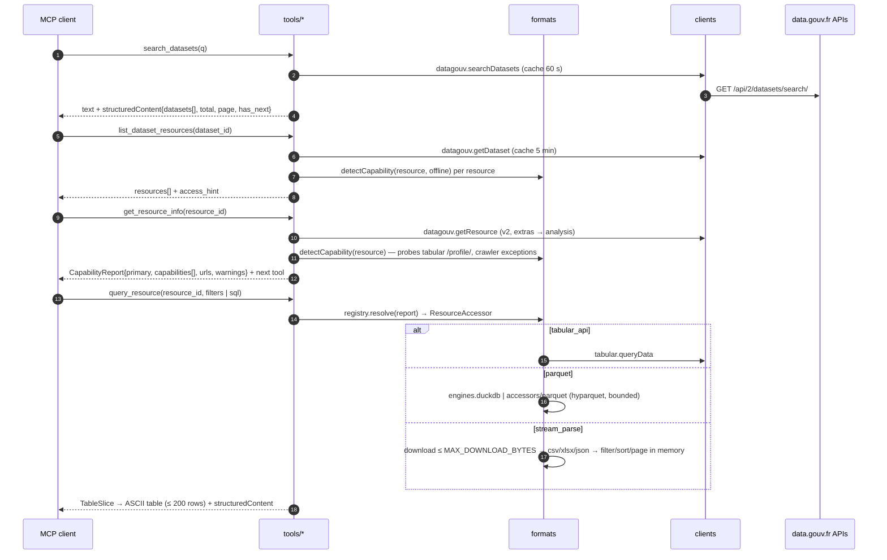

# Architecture

Normative design lives in `.agent/exec-plans/001-typescript-rewrite.md` and the ADRs in
`.agent/decisions/`. This page is the reader-friendly map; when they disagree, the exec plan wins
and this page is stale (open a PR).

## Layers

Five layers, one-way imports, enforced by `scripts/check-layers.ts` (`pnpm check:layers`) and
`tests/unit/layering.test.ts` ([ADR 0004](../.agent/decisions/0004-layering.md)).

| Layer | Directory | Responsibility | May import |
|-------|-----------|----------------|------------|
| core | `src/core/` | `config` (Zod env → `Config`), `errors` (taxonomy), `logger` (pino → stderr), `cache` (LRU, TTL, in-flight dedupe, stale-on-error), `http` (fetch wrapper: timeout, retries, bounded body, Zod parse), `text` helpers, shared domain `types`, `version` | npm only |
| clients | `src/clients/` | One client per upstream service; Zod schemas of raw payloads in `schemas/`; return normalised `core/types` | core |
| formats | `src/formats/` | Capability detection, bounded download, `ResourceAccessor`s per format family, `QueryEngine`s | core, clients |
| tools | `src/tools/` | `ToolDefinition` (schema + LLM description + thin handler) one file per tool; `registry.ts` adapts to the MCP SDK | core, clients, formats |
| server | `src/server/` | `deps.ts` composition, `mcp-server.ts` factory, `stdio.ts`, `http.ts` (Hono), telemetry | everything |
| CLI | `src/index.ts` | `parseArgs` (`--http`, `--stdio`, `--port`, `--host`, `--help`, `--version`) → `runStdio` / `runHttp` | anything |

Rules: tool handlers never call `fetch` (everything via `ToolContext.deps`); cross-layer contracts are
interfaces declared in the *lower* layer (`clients/types.ts`, `formats/types.ts`) so tests substitute
fakes; files ≤ ~300 lines; kebab-case filenames.

## Module map

```
src/
├── index.ts                 CLI entry (stdio default)
├── core/
│   ├── config.ts            loadConfig(env) → Config; DEFAULT_ALLOWED_HOSTS/ORIGINS; resolveBaseUrls(prod|demo)
│   ├── errors.ts            DatagouvError + subclasses, toDatagouvError
│   ├── logger.ts            rootLogger, childLogger(module), setLogLevel
│   ├── cache.ts             Cache interface, createCache (lru-cache)
│   ├── http.ts              createHttpClient({timeoutMs, retries, fetchImpl}) → getJson/getText/head/stream
│   ├── text.ts              truncate, formatBytes, capOutput
│   ├── types.ts             DatasetSummary, ResourceDetail, ResourceAnalysis, TableSchema, TableSlice, Page<T>…
│   └── version.ts           APP_NAME, APP_VERSION, USER_AGENT
├── clients/
│   ├── types.ts             DatagouvClient, TabularClient, MetricsClient, CrawlerClient, SchemaClient, Clients
│   ├── datagouv-client.ts   udata API v1/v2 (search, datasets, resources, organizations, dataservices, reuses, topics, suggest)
│   ├── tabular-client.ts    tabular-api.data.gouv.fr (/profile/, /data/)
│   ├── metrics-client.ts    metric-api.data.gouv.fr (always prod)
│   ├── crawler-client.ts    crawler.data.gouv.fr resources-exceptions (1 h, stale-on-error)
│   ├── schema-client.ts     schema.data.gouv.fr catalogue + Validata
│   └── schemas/*.ts         z.looseObject(...) for raw payloads
├── formats/
│   ├── types.ts             ResourceCapability, CapabilityReport, ResourceAccessor, QueryEngine, QuerySpec, PreviewResult
│   ├── registry.ts          AccessorRegistry.resolve(capabilityReport) in priority order
│   ├── capability.ts        detectCapability(resource, deps, {offline}) — algorithm below
│   ├── download.ts          bounded fetch (gzip, Content-Length + streaming cap, sniffing)
│   ├── accessors/           tabular-api · csv-stream · spreadsheet · json · geojson · parquet · archive · document · api-endpoint · metadata
│   └── engines/             pure-js (always) · duckdb (ENABLE_DUCKDB=1, optional native dep)
├── tools/
│   ├── types.ts             ToolDefinition, ToolContext, ToolResult, defineTool
│   ├── registry.ts          registerTools(server, tools, deps, {maxOutputChars}) — logging, error→isError, capOutput
│   ├── deps.ts              ToolDeps (what tools may ask for)
│   ├── shared/              annotations (read-only hints), search-query (stop words), formatters
│   ├── <tool-name>.ts       one tool per file, legacy order first
│   └── index.ts             ALL_TOOLS
└── server/
    ├── deps.ts              createDeps(config, {fetchImpl}) → ServerDeps {config, http, cache, clients, formats}
    ├── mcp-server.ts        createMcpServer(deps): McpServer (name, version, instructions, registerTools)
    ├── stdio.ts             runStdio(deps)
    ├── http.ts              createHttpApp(deps): Hono — hostOriginGuard, GET /health, POST /mcp; runHttp(deps, port, host)
    └── telemetry/           matomo.ts, sentry.ts (env-gated)
```

## Transports ([ADR 0003](../.agent/decisions/0003-http-framework-and-transports.md))

| | stdio (default) | Streamable HTTP (`--http`) |
|---|---|---|
| Entry | `runStdio` → `StdioServerTransport` | `runHttp` → Hono on `@hono/node-server` |
| Sessions | one process per client | **stateless**: a fresh `McpServer` + `WebStandardStreamableHTTPServerTransport` per `POST /mcp`, `enableJsonResponse: true`, closed after the response |
| Logs | stderr (stdout is the protocol channel) | stderr |
| Extras | — | `GET /health` deep probe (in-process `search_datasets("transport", 1)`, 10 s cap), Host/Origin guard, 404 JSON listing endpoints |

Why stateless: mirrors the legacy `stateless_http=True` deployment and avoids "session not found" with
clients that drop `mcp-session-id`. Server-initiated notifications and SSE streaming are not used
(tracked as TD-005).

## Data flow



Every hop maps failures to a `DatagouvError`; `tools/registry.ts` turns them into
`{ isError: true, content: "Error [CODE]: …\nHint: …", structuredContent: { error } }` — never a
JSON-RPC error for business failures ([ADR 0008](../.agent/decisions/0008-output-shaping-policy.md)).

## Capability detection (summary)

`formats/capability.ts` turns a `ResourceDetail` into a `CapabilityReport` (`primary` +
ordered fallbacks + `urls` + `warnings` + `reasons`). Steps run in order; first match wins as primary
(full algorithm: exec plan §5, research `03-resource-formats-catalog.md` §7):

1. `analysis.checkAvailable === false` or `checkStatus ≥ 400` → `dead_link`
2. `type === "api"`, OGC/ArcGIS formats or `ogcMetadata` → `api_endpoint`
3. documentation types / pdf, html, docx, odt, md, txt, images → `document_preview` (images → `metadata_only`)
4. `analysis.parsingTable` present → `tabular_api` (probe `/profile/` unless offline; crawler exception → `tabular_api_large`)
5. csv/tsv/xlsx/xls/ods file → probe tabular once; on miss: `parquetUrl` → `parquet`, else `stream_parse` (or `remote_caution` above `MAX_DOWNLOAD_BYTES`)
6. parquet or `parquetUrl` → `parquet`
7. geojson/kml/gpx/topojson or `geojsonUrl` → `geo_preview`; plain json/jsonl → `stream_parse`
8. zip/shp/gpkg/kmz/7z/tar.gz/dbf → `archive_inspect` (listing only above the cap)
9. remote resource with nothing matched → `remote_caution` (HEAD only)
10. default → `metadata_only`

Never trust `format` alone (tens of thousands of empty formats); `csv.gz` → csv + gzip; declared MIME
`text/html` on a "csv" raises a mismatch warning; reports are cached 10 min per resource; `offline`
mode (no probes) is used by `list_dataset_resources` / `get_dataset_resources_summary`.

## Cross-cutting policies

| Concern | Policy | ADR |
|---------|--------|-----|
| Errors | 12 codes (`VALIDATION_ERROR`, `NOT_FOUND`, `API_ERROR`, `RATE_LIMITED`, `TIMEOUT`, `NETWORK_ERROR`, `FORMAT_ERROR`, `RESOURCE_UNAVAILABLE`, `UNSUPPORTED_CAPABILITY`, `PAYLOAD_TOO_LARGE`, `ENGINE_UNAVAILABLE`, `INTERNAL_ERROR`, plus `CONFIG_ERROR` at startup); legacy in-band strings preserved as `message` | 0007, 0008 |
| Output | text + `structuredContent`; soft cap `MAX_OUTPUT_CHARS` with explicit truncation notice; ≤ 200 rows, cells ≤ 100 chars, descriptions 200/500 chars, tags 5/10 | 0008 |
| HTTP client | single `HttpClient`; `User-Agent: datagouv-mcp/<version>`; timeout 15 s; 2 retries with backoff + jitter on 408/425/429/5xx; `Retry-After` honoured (≤ 10 s); 404 never retried | 0009 |
| Cache | in-memory LRU (`CACHE_MAX_ENTRIES`); TTLs: search 60 s, details 5 min, tabular profile 10 min, tabular pages 60 s, crawler exceptions 1 h stale-on-error, capability 10 min, schema catalogue 1 h, metrics 10 min; file bytes never cached | 0009 |
| Downloads | `MAX_DOWNLOAD_BYTES` enforced from `Content-Length` and while streaming → `PAYLOAD_TOO_LARGE` | 0009 |
| Query engines | pure-JS always; DuckDB behind `ENABLE_DUCKDB=1` (`@duckdb/node-api`, optional) | 0006 |
| Naming | legacy tool names/params frozen; new tools `<verb>_<object>[_<qualifier>]`, legacy order first | 0007 |
| Validation | zod 4 everywhere (config, payloads as `looseObject`, tool inputs as raw shapes) | 0005 |
| Observability | pino JSON on stderr (`tool called/completed/failed`), `/health`, optional Matomo events and Sentry | exec plan §9 |

## Testing pyramid ([ADR 0010](../.agent/decisions/0010-testing-and-evidence-strategy.md))

Unit (`src/**/*.test.ts`, `tests/unit`) → contract (recorded fixtures replayed through `fetchImpl`)
→ MCP e2e (`tests/e2e`: SDK `Client` over `InMemoryTransport` and HTTP loopback) → architecture
(layering test) → live smoke (`tests/live`, `RUN_LIVE_TESTS=1`, nightly) → evidence reports
(`pnpm evidence`, `docs/evidence/`). See [development.md](development.md).
